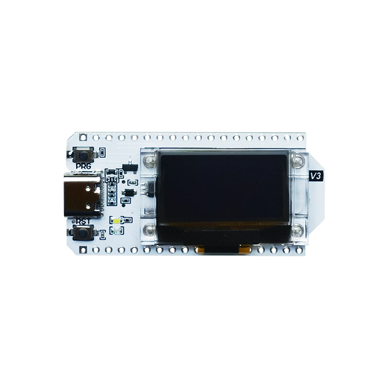
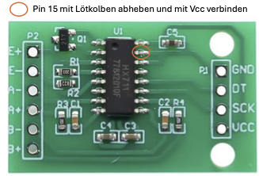

# Upgrade einer einfachen elektronische Kranwaage bis 300 kg.
## Vorteile: Remote ablesen und speichern des Verlaufs
### Anzeigeoptionen:
- Direkt auf dem Display der Waage
- Anzeige der Daten über BLE mit App "Hold Scale"
- Anzeige über Website auf dem ESP32
  - Hotspot SSID "Waage", Passwort "123456789"
  - IP der Website: "192.168.4.1"
### Komponenten:
- Messelement der Waage
- Heltec WiFi Kit 32 (V3)  
  
- HX711 ADC-Board (modifiziert für 80 Messungen / Sekunde)    
 - 3V3 an Pin34 
 - D_OUT an Pin2
 - SCK an Pin3
 - GND an GND

- Taster
 - gegen GND mit ext. PullUp an Pin 6
- LiPo-Zelle 1200 mAh
- Gehäuse aus dem 3D-Drucker (Daten hier unter Housing)
- etwas Geschick im Umgang mit dem Lötkolben

#### Aufbauanleitung folgt ...
